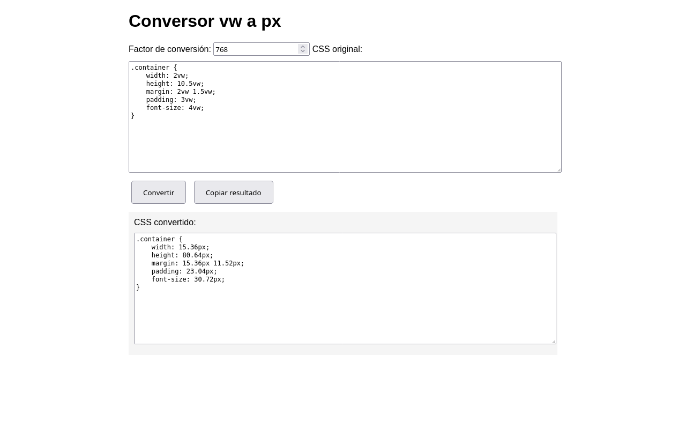

[ 🇬🇧 English Version ](README.md)

# Conversor de Unidades CSS

Una herramienta ligera del lado del cliente que convierte **valores CSS** de unidades `vw` a unidades fijas `px` basándose en un **ancho de referencia definido por el usuario**.
Pega tu CSS, establece el ancho de pantalla objetivo, haz clic en **Convertir** y obtén una versión actualizada lista para copiar.

---

## 🚀 Características

- Totalmente **client-side** — sin backend.
- Convierte valores `vw` a `px` con un solo clic.
- Interfaz limpia y minimalista.
- Ideal para diseñadores y desarrolladores que necesitan una **salida de ancho fijo preciso**.

---

## 🧠 Cómo Funciona

1. Introduce o pega tu CSS que contenga valores `vw`.
2. Define el ancho de pantalla de referencia en píxeles.
3. Haz clic en **Convertir**.
4. La herramienta recalcula todas las unidades `vw` a valores absolutos en `px`.
5. Copia el CSS generado y úsalo donde lo necesites.

---

## ⚡ ¿Por qué usar esta herramienta?

Aunque las unidades `vw` son excelentes para **diseños responsivos**, a veces necesitas valores de píxeles fijos para:

- Diseños estáticos.
- Emails o plantillas con reglas de renderizado estrictas.
- Exportar assets basados en un tamaño de pantalla específico.
- Consistencia en la entrega de diseño (handoff).

Esta herramienta proporciona una solución sencilla **basada en el navegador** sin requerir herramientas de compilación (build tools) ni dependencias.

---

## 🧾 Licencia

Este proyecto está licenciado bajo la **Licencia MIT**.  
Consulta la licencia completa aquí: [https://opensource.org/licenses/MIT](https://opensource.org/licenses/MIT)

---

## 🧑‍💻 Autor

Desarrollado por [**X Software**](https://xsoftware.es).  
Desarrollo de software Linux, soluciones web y automatización de sistemas.
